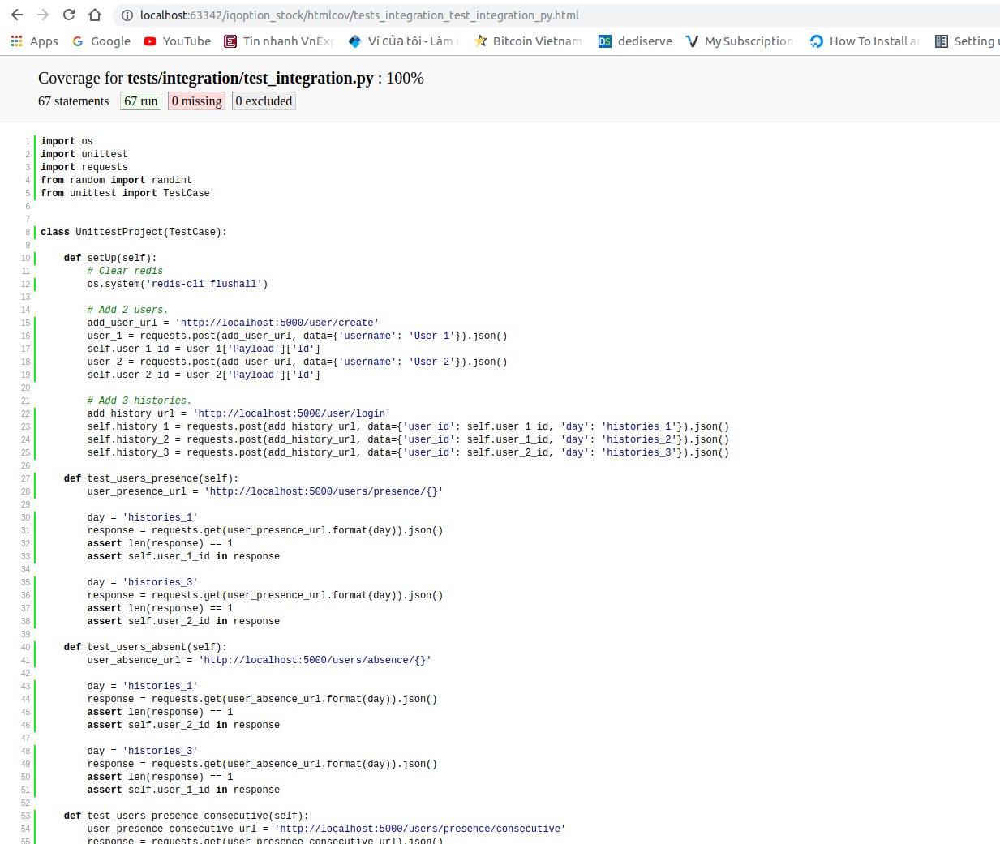

Mobile Health Test
---

### Procedures

1. Install Redis server on local computer. Default host=localhost, port=6379
```buildoutcfg
    sudo apt-get install redis-server
```

2. Build environment by virtualenv
```buildoutcfg
    virtualenv -p python3 venv
    source venv/bin/activate
    pip install -r requirements.txt
```

3. Start Project
```buildoutcfg
    python app.py
```

4. Testing (Adding project directory into venv path)
```buildoutcfg
    python tests/integration/test_integration.py
```

### Models

1. Users
    - key: user_{user_id}
    - value: Information of user. eg: name

2. Histories
    - key: histories_{day}
    - value: list of logged-in user_id eg: [user_id_1, user_id_2, ...]


### Integration test

| Days | User_1 | User_2 |
| --- | ---| --- |
| histories_1 | O | X|
| histories_2 | O | X|
| histories_3 | X| O |
(O: Precense , X: Absence)

1. Case 1. Get_user_precence_of_day_1 => user_1
2. Case 2. Get_user_precence_of_day_2 => user_2
3. Case 3. Get_user_absence_of_day_1 => user_2
4. Case 4. Get_user_absence_of_day_2 => user_1
5. Case 5. Get_user_precence_consecutive => user_1
6. Case 6. Get_user_absence_consecutive => user_2


Test 100 users




